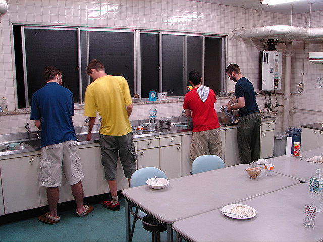
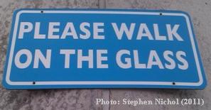

!SLIDE title-slide
# Ashish Dixit #

!SLIDE center

# @tundal45 #

!SLIDE center
# Doing Dishes & Technical Debt #

!SLIDE center

  <a href="https://twitter.com/#!/ngauthier/status/85832284716019712">Link to the twitter conversation</a>

!SLIDE center
# Why am I talking about it? #

!SLIDE center
# Experienced dish washer (& procrastinator of doing dishes) #

!SLIDE center
# Recent experience of coming into a tested codebase #

!SLIDE center
# Lightning talks are good old fashioned fun #

!SLIDE center
# If our code were a kitchen sink #

!SLIDE center
# Goal #

  Photo:<a href="http://www.flickr.com/photos/king-molan/249807023/"> King Molan</a>

!SLIDE center

  Photo:<a href="http://www.flickr.com/photos/spike55151/2883114571/"> spike55151</a>

!SLIDE center
# but I don't wanna #

  Photo:<a
href="http://www.flickr.com/photos/jamelah/2178487467/"> jamelah</a>

!SLIDE center
# it quickly gets away from us #

  Photo:<a
href="http://www.flickr.com/photos/owlpacino/4136584359/"> owlpachino</a>

!SLIDE center
# BOOM! #

  Photo:<a
href="http://blog.castsoftware.com/wp-content/uploads/2011/02/Tech-Debt.png"> blog.castsoftware.com</a>

!SLIDE center
# sometimes we can quickly take care of it #

  Photo:<a
href="http://www.flickr.com/photos/elanaspantry/2546198480"> elanaspantry</a>

!SLIDE center
# but usually we need ... #

  Photo:<a
href="http://www.flickr.com/photos/jgelens/48296109/"> jgelens</a>

!SLIDE center
# if we are not careful #

  Photo:<a
href="http://www.flickr.com/photos/outofideas/280343710"> outofideas</a>

!SLIDE center
# things get out of hand #

  Photo:<a
href="http://www.flickr.com/photos/hjem/282751055"> hjem</a>

!SLIDE center
# it's a bad sign #

  Photo:<a
href="http://www.flickr.com/photos/timespace1981/5908580898/"> timespace1981</a>

!SLIDE center
# HALP! #

  Photo:<a
href="http://www.flickr.com/photos/viralbus/1434889064"> viralbus</a>

!SLIDE center
# unfortunately #

  Photo:<a
href="http://www.flickr.com/photos/jpjoshi/4904864110/"> jpjoshi</a>

!SLIDE center
# even the *BEST* tools ... #

  Photo:<a
href="http://www.flickr.com/photos/fudj/82932373"> fudj</a>

!SLIDE center
# going back to Nick's advice #

  Photo:<a
href="http://memegenerator.net/instance/9264605"> memegenerator</a>

!SLIDE center
# a clean kitchen enables us to ... #

!SLIDE center
# ... spot mess quickly #

  Photo:<a
href="http://www.flickr.com/photos/schoschie/51653220/"> schoschie</a>

!SLIDE center
# ... focus on more important things #

  Photo:<a
href="http://www.flickr.com/photos/vvvracer/4949970806"> vvvracer</a>

!SLIDE center
# ... have anyone chip in #

  Photo:<a
href="http://www.flickr.com/photos/seandreilinger/4784668897/"> seandreilinger</a>

!SLIDE center
# ... make our customers happy #

  Photo:<a
href="http://www.flickr.com/photos/benmillett/306074038/"> benmillett</a>

!SLIDE center
# so we can take this #

  Photo:<a
href="http://www.flickr.com/photos/lazylikewally/3176959921">
lazylikewally</a>

!SLIDE center
# and transform it into this #

  Photo:<a
href="http://www.flickr.com/photos/schneeman/3766882821"> schneeman</a>

!SLIDE center
# Thanks #

!SLIDE bullets
# shout-outs #

* [Nick Gauthier](http://www.ngauthier.com/) for the topic idea
* [Solarized](http://ethanschoonover.com/solarized) for slide theme
  inspiration
* [Rick Bradley's 2010 RailsConf Presentation](https://github.com/rick/presentation_railsconf_2010) for in-slide photo attribution code
